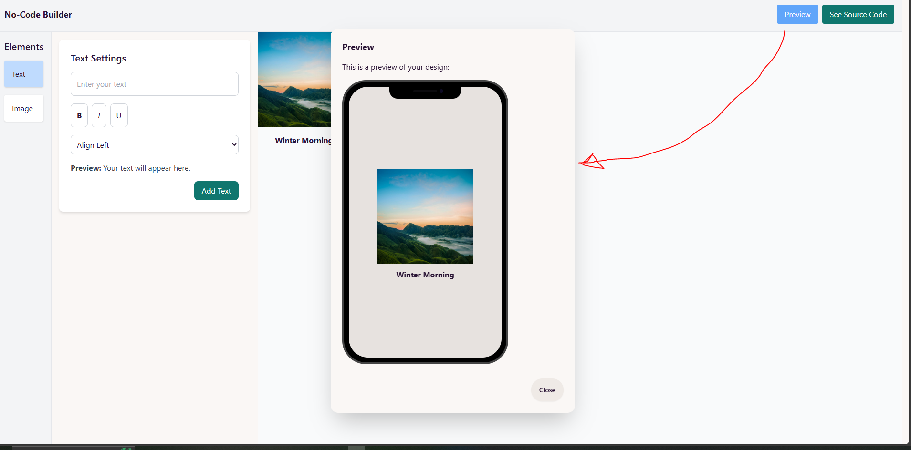

# No-Code Builder





I developed a no-code builder where users can add styled text (bold, italic, underline) and images with adjustable height, width, and alignment, displaying them on a canvas. The top bar includes a Preview button, which switches to a mobile view of the canvas elements, and a "See Source Code" button to view the HTML/CSS structure of the canvas content.

## Features

- **Text Styling**: Users can add text to the canvas with the following styles:
  - Bold
  - Italic
  - Underline
- **Image Customization**: Users can add images to the canvas with adjustable properties:
  - Height
  - Width
  - Alignment (left, center, right)
- **Preview Mode**:
  - Click the "Preview" button to switch to a mobile view and see how the canvas elements will appear on smaller screens.
- **View Source Code**:
  - Click the "See Source Code" button to view the HTML and CSS code of the canvas design.

## Installation

1. Clone the repository:
   ```bash
   git clone https://github.com/username/no-code-builder.git
   ```
2. Run this project:

   ```bash
   npm install
   ```

   ```bash
   npm start

   ```
